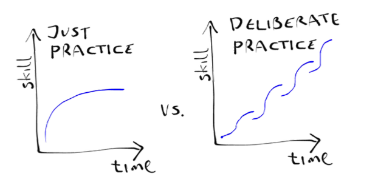

# Learn AI & DS with Deliberate Practice

This repo is my safe place and accountability means to learn and practice my skills in artificial intelligence (AI) and data science (DS) field.

I have explored AI and DS for more than a year since I first write this paragraph in November 2021. But I guess I'm not very intentional and well-practised in my learning. This is the time to sort that out.

## Why learn Artificial Intelligence?
I can't say that I have a logical explanation here. "AI" caught my interest since the first time I heard the term. Other than to satisfy my curiousity, it is also fascinating to understand the underlying principle of the cool (and uncool) implications of this technology--so I can build something out of it.

## Why learn Data Science?
Not only looking at the career prospect (also the case with AI), but I see that in Data Science, there's so many sub skills that are essential to navigate this information-driven era, even if you are not an aspiring data scientist.

## Why learn both AI and DS?
Well, there is so many intersection between AI and DS, right? So it will be almost like passing two islands in one row. It will require more efforts and focus. But I am a firm believer that today we need more $\pi$ shaped experts: a generalist with few specialities. Now, I'm still in that "become a generalist" phase.

If you find my "why" explanations is quite shallow (I only express a portion of my personal, selfish motivations), then there are millions of articles out there that will do the elaboration job. 

## How will I do it?

### Deliberate practice

Traditional practice is doing things in mindless repetition. Deliberate practice is doing things in focused, specific intention. It is
- designed to improve performance,
- repeating things a lot for a specific improvement,
- in need of continous feedbacks,
- mentally demanding, and ultimately
- not fun.

So, in applying deliberate practice, there should exist
- a success definition,
- a contingent plan and strategies,
- a learning management,
- a space and time to reflect and review, and
- determinations

for this learning project.

I mentioned that I have surf over the AI and DS subjects for a while. Now, this repo will push me to step up my game by sharing my learning notes, exercise notebooks, and mini-projects to the Github public. I put the mindset that I'm a teacher thus I should write and explain what I've learned in a clear and concise language.

This project will last me for one or two years journey. I plan to block 1-2 hours per day for this project in typical days and the repo will be updated frequently.

## The Curriculuum

So far, I have planned to learn (or re-learn) the following topics almost in order:
1. Fundamentals of AI
3. Machine Learning
4. Deep Learning
5. Computer Vision
6. Natural Language Processing
7. Reinforcement Learning
8. Graph Machine Learning*
9. SQL
10. Data Science Experiment Design
11. (a bit of) Data Engineering
12. (a bit of) MLOps
 
*: this is a niche field but so close to heart I have to separate it from other subjects

Note that I have a bachelor mathematics degree under my sleeve, so I won't grinding through statistics and linear algebra exclusively. But I definitely will revisit them.

The learning resources are diverse. I'll take course from platform such as Coursera, Standford Onlines, Udacity, Fast.ai; read various books; and dissect papers. I will mention and link the source in the individual notes.

---

Previously, this repository is an archive for my courseworks in MA4072 Pembelajaran Mendalam (Deep Learning) from Institut Teknologi Bandung.

---

If you have any feedback, you can send it to *ilmaaliyaf at gmail*.